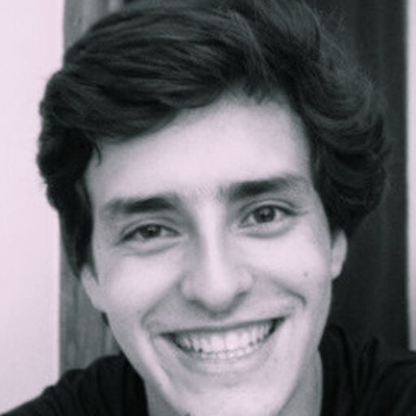
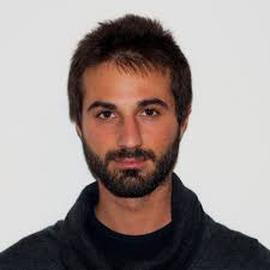
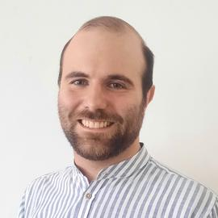

# PyC Team

```{list-table}
:widths: 15 85
:header-rows: 0
:align: center

* - 
  - **Pietro Barbiero**<br>
    Postdoc<br>
    Universita' della Svizzera Italiana (CH) and University of Cambridge (UK)
* - 
  - **Gabriele Ciravegna**<br>
    Postdoc<br>
    Politecnico di Torino (IT)
* - 
  - **David Debot**<br>
    PhD student<br>
    KU Leuven (BE)
* - 
  - **Michelangelo Diligenti**<br>
    Assistant Professor<br>
    Università degli Studi di Siena (IT)
* - 
  - **Gabriele Dominici**<br>
    PhD student<br>
    Universita' della Svizzera Italiana (CH)<br>
    CEO & Co-founder, InfinityGen (CH)
* - 
  - **Mateo Espinosa Zarlenga**<br>
    PhD student<br>
    University of Cambridge (UK)
* - 
  - **Francesco Giannini**<br>
    Research Fellow<br>
    Scuola Normale Superiore di Pisa (IT)
* - 
  - **Giuseppe Marra**<br>
    Assistant Professor<br>
    KU Leuven (BE)
* - 
  - **Alberto Termine**<br>
    Postdoc<br>
    IDSIA/SUPSI (CH)
```
